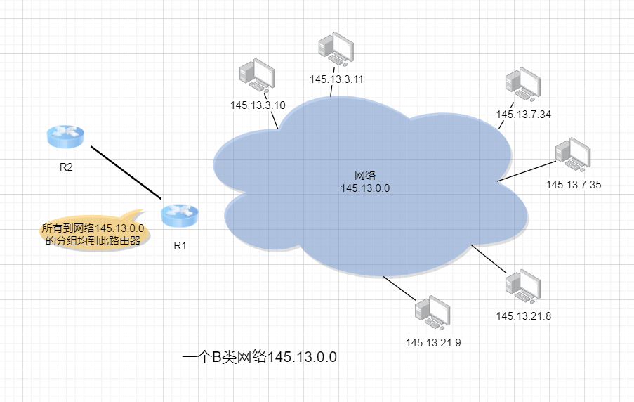

# IPv4地址表示法详解

在TCP/IP协议中，IP地址是一个最基本的概念，本文就来参考《计算机网络》谢希仁 这本书，总结一下IPv4地址表示法的发展阶段，做个读书笔记。

IP地址的编址方法共经过了三个历史阶段：

1. **分类的IP地址**，这是最基本的编址方法，在1981年就通过了相应的标准协议。
2. **子网的划分**，这是对最基本的编址方法的改进，其标准RFC 950在1985年通过。
3. **无分类编址**，这是比较新的无分类编址方法，1993年提出后很快就得到推广应用。

## 传统分类的IP地址

### 概念

传统分类的IP地址就是将IP地址划分为若干个固定类，每一类地址都由两个固定长度的字段组成，其中第一个字段是网络号，它标志主机所连接到的网络。第二个字段是主机号，它标志着该主机。

一个网络号在整个互联网范围内必须是唯一的。

一个主机号在它前面的网络号所指明的网络范围内必须是唯一的。

> 这里要指出，由于近年来已经广泛使用无分类IP地址进行路由选择，A类、B类和C类地址的区分已成为历史[RFC 1812]

其实还有D类（广播地址）和E类（保留地址）本文暂不考虑。

### 表示

### 几种特殊IP

- 网络号全为0（00000000）

IP地址中的全0表示“这个(this)”。网络号字段为全0的IP地址是个保留地址，意思是“本网络”。

- 网络号为127（01111111）

保留作为本地环回地址，作为本主机的进程之间通信之用。

- 主机号全为0

代表整个网络本身，即本网段

- 主机号为255（11111111）

为广播地址，代表本网络中的所有地址

> 0.0.0.0 和 127.0.0.1 的通俗解释：
>
> 假设你有一台服务器，IP地址为49.233.87.25，在这台服务器上你要配置一个nginx网站。
>
> 将nginx监听为0.0.0.0.0:80，那么互联网上的任何人都可以在浏览器中访问49.233.87.25:80，来访问你的站点。
>
> 将nginx监听为127.0.0.1:80，你只能在你的服务器上，用curl 127.0.0.1:80来访问你的站点。

> localhost 和 127.0.0.1
>
> localhost 是 127.0.0.1 的域名，它俩是一个东西。

### 地址的指派范围

| 网络类别 |   最大网络数    | 第一个网络号 | 最后一个网络号 | 网络中的最大主机数 |
| :------: | :-------------: | :----------: | :------------: | :----------------: |
|   A类    |   126(2^7-2)    |      1       |      126       |      16777214      |
|   B类    |  16383(2^14-1)  |    128.1     |    191.255     |       65534        |
|   C类    | 2097151(2^21-1) |   192.0.1    |  223.225.225   |        254         |

### 问题

1. IP地址空间的利用率有时很低

每一个A类地址网络可连接的主机数超过1000万台，而每一个B类地址网络可连接的主机数也超过6万台。然而有些网络对连接在网络上的计算机数目有限制，根本达不到这样大的数值。

有的单位申请到了一个B类地址网络，但所连接的主机数并不多，可是又不愿意申请一个足够使用的C类地址，理由是考虑到今后可能的发展

2. 给每一个物理网络分配一个网络号会使路由表变得太大因而使网络性能变坏

每一个路由器都应当能够从路由表查出应怎样到达其他网络的下一跳路由器。因此，互联网中的网络数越多，路由器的路由表的项目数也就越多

3. 两级IP地址不够灵活

有时情况紧急，一个单位需要在新的地点马上开通一个新的网络。但是在申请到一个新的IP地址之前，新增加的网络是不可能连接到因特网上工作的。

## 子网的划分

为解决上述问题，从1985年起在IP地址中又增加了一个“子网号字段”，使两级IP地址变成为三级IP地址，它能够较好地解决上述问题，并且使用起来也很灵活。这种做法叫作划分子网

### 基本思路

1. 内部可见，外部不变

一个拥有许多物理网络的单位，可将所属的物理网络划分为若干个子网。划分子网纯属一个单位内部的事情。本单位以外的网络看不见这个网络是由多少个子网组成，因为这个单位对外仍然表现为一个网络。

2. IP地址 = 网络号 + 子网号 + 主机号

划分子网的方法是，从该网络的主机号中借用几位作为子网号，当然主机号也就相应的减少几位。

3. 先找网络号，再找子网号

凡是从其他网络发送给本单位某个主机的IP数据报，仍然是根据IP数据报的目的网络号找到连接在本单位网络上的路由器。但此路由器在收到IP数据报后，再按子网号找到目的子网，把IP数据报交付目的主机。

### 示例

假设某单位有一个B类地址，网络地址为145.13.0.0，即表示凡目的地址为145.13.x.x的数据报都被送到这个网络上的路由器R1

这里假定子网号占用8位，即主机号还剩余8位可用。将网络划分为三个子网，145.13.3.0，145.13.7.0，145.13.21.0

### 子网掩码

现在有一个问题就是，假设有一个目的地址为145.13.3.10的数据报转发到了路由器R1，哪R1如何将其转发到子网145.13.3.0呢？

由于32位的IP地址本身以及数据报的首部都没有包含任何有关子网划分的信息，所以为了解决上述问题，必须引入额外信息，这就是子网掩码。

IP地址和子网掩码按位与（AND），即可得到网络号。

> 现在因特网的标准规定：所有的网络都必须使用子网掩码，同时在路由器的路由表中也必须有子网掩码这一栏。
>
> 如果一个网络不划分子网，那么该网络的子网掩码就使用默认子网掩码。默认子网掩码中1的位置和IP地址中的网络号字段正好相对应。

A类地址，默认子网掩码 255.0.0.0

B类地址，默认子网掩码 255.255.0.0

C类地址，默认子网掩码 255.255.255.0

### 路由转发

要注意，使用子网划分后，路由表必须包含以下三项：**目的网络地址**，**子网掩码**，和**下一跳地址**。

 源主机H1（128.30.33.13）向目的主机H2（128.30.33.138）发送数据时的过程如下：

1. 目的IP地址与网络1的子网掩码按位与得到128.30.33.128，不等于网络1的地址128.30.33.0，即H1和H2不在同一个子网内，所以数据转发给路由器R1
2. R1收到数据报后，逐行检查路由表，最终发现128.30.33.138和255.255.255.128按位与，得到128.30.33.128，匹配第二行，所以R1将数据报从接口1直接交付给目的主机H2

### 问题

划分子网在一定程度上缓解了因特网在发展中遇到的困难。但是在1992年因特网依旧遇到如下问题：

1. B类地址在1992年已分配了近一半，眼看很快就将全部分配完毕！
2. 因特网主干网上的路由表中的项目数急剧增长（从几千个增长到几万个）。

## 无分类编址CIDR

### 概念

CIDR**消除了传统的A类、B类和C类地址以及划分子网的概念**，把32位的IP地址划分为两个部分，前面是**网络前缀**，用来指明网络，后面的部分用来指明主机。CIDR是**无分类**的两级编址，IP地址 = 网络前缀 + 主机号

CIDR计法在IP地址后面加上斜线“/”，然后写上网络前缀所占的位数

### 地址块

CIDR把网络前缀都相同的连续的IP地址组成一个“CIDR地址块”，我们只要知道地址块中的任何一个地址，就可以知道这个地址块的起始地址和最大地址，以及地址块中的地址数。

举例：

已知128.14.35.7/20是某CIDR地址块中的一个地址

128.14.35.7/20 = **10000000000011100010**001100000111

可知：

最小地址：128.14.32.0  = **10000000000011100010**000000000000

最大地址：128.14.47.255 = **10000000000011100010**111111111111

地址数：2^12个

### 地址掩码

为了更方便地进行路由选择，CIDR使用32位的地址掩码，地址掩码由一串1和一串0组成，而1的个数就是网络前             缀的长度。

例如，/20地址块的地址掩码是：11111111 11111111 11110000 00000000（20个连续的1）

注意：虽然CIDR不再使用子网，但是由于目前一些网络还使用子网划分和子网掩码，因此CIDR使用的地址掩码也可以继续称为子网掩码。

> “CIDR不使用子网”是指CIDR并没有在32位地址中指明若干位作为子网字段。但分配到一个CIDR地址块的单位，仍然可以在本单位内根据需要划分出一些子网。
>
> 这些子网也都只有一个网络前缀和一个主机号字段，但子网的网络前缀比整个单位的网络前缀要长些。
>
> 例如，某单位分配到地址块/20，就可以再继续划分为8个子网（即需要从主机号中借用3位来划分子网）。这时每一个子网的网络前缀就变成23位（原来的20位加上从主机号借来的3位），比该单位的网络前缀多了3位。

### 地址聚合

如上图所示，假定某ISP拥有地址块206.0.64.0/18（相当于有64个C类网络）

ISP可以给该大学分配一个地址块206.0.68.0/22（相当于有4个C类网络）

这个大学然后可自由地对本校的各系分配地址块

而各系还可再划分本系的地址块

> CIDR的地址块分配有时不易看清，这是因为网络前缀和主机号的界限不是恰好出现在整数字节处，只要写出二进制表示形式，就清晰了

从上图就可以清楚地看出**地址聚合**的概念。这个ISP共拥有64个C类网络。如果不采用CIDR技术，则在与该ISP的路由器交换路由信息的每一个路由器的路由表中，就需要有64个项目。（如第二节中的R1路由器，路由表中就有三个子网的信息）

但采用地址聚合后，就只需用路由聚合后的一个项目206.0.64.0/18就能找到该ISP。（即构成超网）

### 最长前缀匹配

在CIDR中，由于采用了网络前缀这种记法，IP地址由网络前缀和主机号这两部分组成。因此路由表的每条记录由**网络前缀**和**下一跳**组成。

但是，在查找路由表的时候，可能有多条记录匹配，应当从匹配结果中选择具有最长网络前缀的路由，即最长前缀匹配。

## 参考资料

《计算机网络》谢希仁 编著

[B类地址第一个可分派的网络号为什么不是128.0？](https://www.zhihu.com/question/37927675)

[ Special-Use IPv4 Addresses](https://tools.ietf.org/html/rfc3330)

