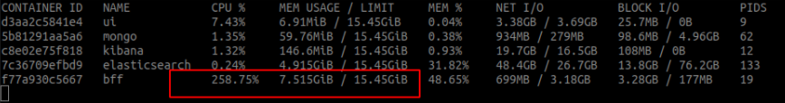
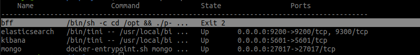
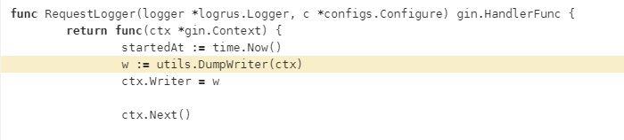
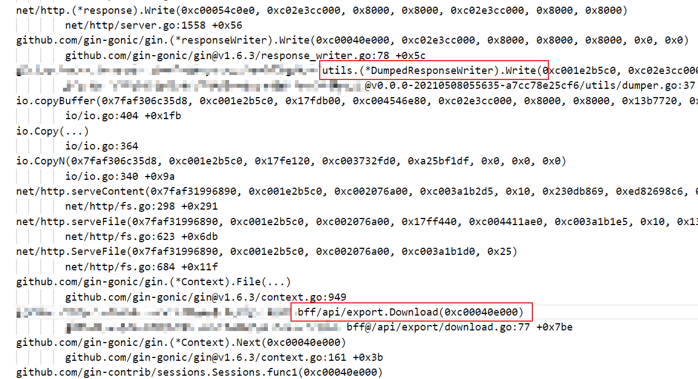

# 一次 Go 程序 out of memory 排查及反思


## 前言

最近在搞数据导出模块，在测试大文件下载的过程中，报了 **Out of memory** (**OOM**) 错误，因为之前没有遇到过这类问题，导致此次排查问题花费了大半天，也走了不少弯路，特此复盘记录。

## 现象描述

和往常一样复制粘贴完最后一个下载接口，没什么问题的话，导出模块就可以收工了。

上服务器部署完，随便测试了几个小文件的下载，一切按照预期正常地运行。

随后我点击下载了一个 2.6G 的大文件，情况变得糟糕起来，通过 ``docker stats`` 观察到其内存一直上涨到 7G 左右，然后容器 ``Exit 2``，日志报 ``fatal error: runtime: out of memory``。






此时我一点都不紧张，甚至有点高兴，刚好这几天在看 pprof，并且平时 curd 干多了，正好来点 bug 调解一下心情~

## 排查过程

### 现场日志

```shell
fatal error: runtime: out of memory

runtime stack:
runtime.throw(0x1447dc3, 0x16)
        runtime/panic.go:774 +0x72
runtime.sysMap(0xc13c000000, 0x130000000, 0x3202418)
        runtime/mem_linux.go:169 +0xc5
runtime.(*mheap).sysAlloc(0x31e12c0, 0x130000000, 0x7f4cfdffaae8, 0x43d067)
        runtime/malloc.go:701 +0x1cd
runtime.(*mheap).grow(0x31e12c0, 0x98000, 0xffffffff)
        runtime/mheap.go:1255 +0xa3
runtime.(*mheap).allocSpanLocked(0x31e12c0, 0x98000, 0x3202428, 0x7f4c00000000)
        runtime/mheap.go:1170 +0x266
runtime.(*mheap).alloc_m(0x31e12c0, 0x98000, 0x101, 0x7f4cfdffac08)
        runtime/mheap.go:1022 +0xc2
runtime.(*mheap).alloc.func1()
        runtime/mheap.go:1093 +0x4c
runtime.(*mheap).alloc(0x31e12c0, 0x98000, 0x7f4cfd010101, 0x43e155)
        runtime/mheap.go:1092 +0x8a
runtime.largeAlloc(0x12fffff10, 0xc000040101, 0xc001816180)
        runtime/malloc.go:1138 +0x97
runtime.mallocgc.func1()
        runtime/malloc.go:1033 +0x46
runtime.systemstack(0xc001d80180)
        runtime/asm_amd64.s:370 +0x66
runtime.mstart()                                       
        runtime/proc.go:1146
```

由于 go panic 时，将所有的 goroutine 调用栈都打印了出来，报错信息铺了好几页，而且第一行是一个 runtime error，**所以当时我就粗略地看了一下，并没有找到什么有用日志**。

### 分析代码

```go
// file download
filePath := path.Join(ms.Configs().GetString("system.exportPath"), filename)

f, _ := os.Open(filePath)
defer f.Close()
stat, _ := f.Stat()

c.Writer.WriteHeader(http.StatusOK)
c.Header("Content-Disposition", "attachment; filename="+filename)
c.Header("Content-Type", "application/octet-stream")
c.Header("Content-Length", fmt.Sprintf("%d", stat.Size()))
c.File(filePath)
```

核心代码就这么几行，而且还是从老项目中复制过来的，怎么可能出问题？？？


此时我的内心开始甩锅了，**可能是环境的问题？老项目用的是 k8s，现在用的是 docker-compose、老项目用的是 go1.13 现在是 go1.15。**

### demo测试

**由于项目依赖较多，本地运行不太方便，于是我写了一个小 demo**，打算不用 docker 直接跑起来（准备把锅甩给 docker）

```go
func main() {
	r := gin.Default()
	r.GET("/download", func(c *gin.Context) {
		filename := "cb6mp2mh843u.zip"
		filePath := path.Join("/data", filename)
		c.Writer.WriteHeader(http.StatusOK)
		c.Header("Content-Disposition", "attachment; filename="+filename)
		c.Header("Content-Type", "application/octet-stream")
		c.File(filePath)
	})
	r.Run("0.0.0.0:8686")
}
```

demo 跑起来后，多次测试，内存使用情况一切正常，此时我陷入了沉思......

### pprof

没办法，只好用 pprof 了，刚好现学现用。


使用 pprof 采集了 heap 的数据，很快就找到了问题，项目使用的小组内基于 gin 封装的一个轮子，为了记录 response body 日志，将其 Dump 了下来，2.6G 的数据呀...

于是我顺手加了个 if else 判断，修了这个 bug




## 复盘反思

> 所以当时我就粗略地看了一下，并没有找到什么有用日志

程序出错时报的日志，里面包含了最重要，直接的排查线索，一定要仔细地将每一行都看一遍，不能由于信息较多，就忽略它。

事后统计当时报错的日志就 300 多行，12 个 goroutine，如果稍微仔细看一下，我相信很快就能定位到问题所在，也不用水这一篇文章了。




> 可能是环境的问题？老项目用的是 k8s，现在用的是 docker-compose、老项目用的是 go1.13 现在是 go1.15

在出现问题时，程序员总是喜欢将锅甩给环境、工具等，不是说这些基础组件一定没有 bug，而是对于大多数的 CRUD 程序来说，根本触发不了底层组件的问题。

所以当没有十足的证据来表明是基础组件的问题时，我们还是老老实实地分析自己的代码，别把路走偏了。


> 由于项目依赖较多，本地运行不太方便，于是我写了一个小 demo

在写 demo 时，一定要注意单一变量原则，项目中使用了组内基于 gin 封装的一个小轮子，而 demo 中使用的是原生的 gin，最难受的是，最终排查到是小轮子的 bug。

