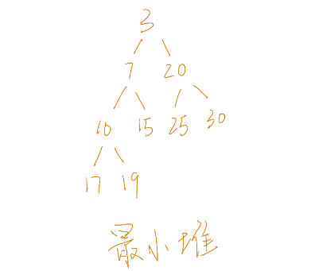

# 堆 堆排序 优先队列

## 引入

在实际应用中，我们经常需要从一组对象中查找**最大值**或**最小值**。当然我们可以每次都先排序，然后再进行查找，但是这种做法效率很低。哪么有没有一种特殊的数据结构，可以高效率的实现我们的需求呢，答案就是**堆(heap)**

堆分为最小堆和最大堆，它们的性质相似，我们以最小堆为例子。

## 最小堆

### 举例



如上图所示，就为一个最小堆。

### 特性

- 是一棵完全二叉树

> 如果一颗二叉树的任何结点，或者是树叶，或者左右子树均非空，则这棵二叉树称做满二叉树（full binary tree）
>
> 如果一颗二叉树最多只有最下面的两层结点度数可以小于2，并且最下面一层的结点都集中在该层最左边的连续位置上，则此二叉树称做完全二叉树（complete binary tree）


- 局部有序

最小堆对应的完全二叉树中所有结点的值均不大于其左右子结点的值，且一个结点与其兄弟之间没有必然的联系

> 二叉搜索树中，左子 < 父 < 右子

### 存储结构

由于堆是一棵完全二叉树，所以我们可以用顺序结构来存储它，只需要计算简单的代数表达式，就能够非常方便的查找某个结点的父结点和子节点，既避免了使用指针来保持结构，又能高效的执行相应操作。

```
结点i的左子结点为2xi+1,右子结点为2xi+2
结点i的父节点为(i-1)/2
```


### 数据结构

```go
// 本例为最小堆
// 最大堆只需要修改less函数即可
type Heap []int

func (h Heap) swap(i, j int) {
	h[i], h[j] = h[j], h[i]
}

func (h Heap) less(i, j int) bool {
	return h[i] < h[j]
}
```

如上所示，我们使用slice来存储我们的数据，为了后续方便我们在此定义了 ```swap``` 和 ```less``` 函数，分别用来交换两个结点和比较大小。

### 插入-Push


如上图所示，首先，新添加的元素加入末尾。

为了保持最小堆的性质，需要沿着其祖先的路径，**自下而上**依次比较和交换该结点与父结点的位置，直到重新满足堆的性质为止。

这样会出现两种情况，要么新结点升到最小堆的顶端，要么到某一位置时发现父结点比新插入的结点关键值小。

上面的流程代码如下：

```go
func (h Heap) up(i int) {
	for {
		f := (i - 1) / 2 // 父亲结点
		if i == f || h.less(f, i) {
			break
		}
		h.swap(f, i)
		i = f
	}
}
```

实现了最核心的 ```up``` 操作后，我们的插入操作 ```push``` 便很简单，代码如下：

```go
// 注意go中所有参数转递都是值传递
// 所以要让h的变化在函数外也起作用，此处得传指针
func (h *Heap) Push(x int) {
	*h = append(*h, x)
	h.up(len(*h) - 1)
}
```

### 删除-Remove


如上图所示，首先把最末端的结点填入要删除节点的位置，然后删除末端元素，同理，这样做也可能导致破坏最小堆的堆序特性。

为了保持堆的特性，末端元素需要与被删除位置的父结点做比较，如果小于父结点，就要up（详细代码看插入）如果大于父结点，就要再和被删除位置的子结点做比较，即down，直到该结点下降到小于最小子结点为止。

上面down的流程代码如下：

```go
func (h Heap) down(i int) {
	for {
		l := 2*i + 1 // 左孩子
		if l >= len(h) {
			break // i已经是叶子结点了
		}
		j := l
		if r := l + 1; r < len(h) && h.less(r, l) {
			j = r // 右孩子
		}
		if h.less(i, j) {
			break // 如果父结点比孩子结点小，则不交换
		}
		h.swap(i, j) // 交换父结点和子结点
		i = j        //继续向下比较
	}
}
```

实现了核心的 ```down``` 操作后，我们的 ```Remove``` 便很简单，代码如下：

``` go
// 删除堆中位置为i的元素
// 返回被删元素的值
func (h *Heap) Remove(i int) (int, bool) {
	if i < 0 || i > len(*h)-1 {
		return 0, false
	}
	n := len(*h) - 1
	h.swap(i, n) // 用最后的元素值替换被删除元素
	// 删除最后的元素
	x := (*h)[n]
	*h = (*h)[0:n]
	// 如果当前元素大于父结点，向下筛选
	if (*h)[i] > (*h)[(i-1)/2] {
		h.down(i)
	} else { // 当前元素小于父结点，向上筛选
		h.up(i)
	}
	return x, true
}
```

### 弹出-Pop

当i=0时，```Remove``` 就是 ```Pop```

```go
// 弹出堆顶的元素，并返回其值
func (h *Heap) Pop() int {
	n := len(*h) - 1
	h.swap(0, n)
	x := (*h)[n]
	*h = (*h)[0:n]
	h.down(0)
	return x
}
```

### 初始化-Init

在我们讲完了堆的核心操作 ```up``` 和 ```down``` 后，我们来讲如何根据一个数组构造一个最小堆。

其实我们可以写个循环，然后将各个元素依次 ```push``` 进去，但是这次我们利用数学规律，直接由一个数组构造最小堆。

首先，将所有关键码放到一维数组中，此时形成的完全二叉树并不具备最小堆的特征，但是仅包含叶子结点的子树已经是堆。

即在有n个结点的完全二叉树中，当 ```i>n/2-1``` 时，以i结点为根的子树已经是堆。

```go
func (h Heap) Init() {
	n := len(h)
	// i > n/2-1 的结点为叶子结点本身已经是堆了
	for i := n/2 - 1; i >= 0; i-- {
		h.down(i)
	}
}
```

### 测试

```go
func main() {
	var h = heap.Heap{20, 7, 3, 10, 15, 25, 30, 17, 19}
	h.Init()
	fmt.Println(h) // [3 7 20 10 15 25 30 17 19]

	h.Push(6)
	fmt.Println(h) // [3 6 20 10 7 25 30 17 19 15]

	x, ok := h.Remove(5)
	fmt.Println(x, ok, h) // 25 true [3 6 15 10 7 20 30 17 19]

	y, ok := h.Remove(1)
	fmt.Println(y, ok, h) // 6 true [3 7 15 10 19 20 30 17]

	z := h.Pop()
	fmt.Println(z, h) // 3 [7 10 15 17 19 20 30]
}
```

### 完整代码

[Github](https://github.com/YahuiAn/Algorithm/blob/master/DataStructure/Heap.go)

## 堆排序

在讲完堆的基础知识后，我们再来看堆排序就变得非常简单。利用最小堆的特性，我们每次都从堆顶弹出一个元素（这个元素就是当前堆中的最小值），即可实现升序排序。代码如下：

```go
// 堆排序
var res []int
for len(h) != 0 { 
    res = append(res, h.Pop())
}
fmt.Println(res)
```

## 优先队列

优先队列是0个或者多个元素的集合，每个元素都有一个关键码，执行的操作有查找，插入和删除等。

优先队列的主要特点是支持从一个集合中快速地查找并移出具有最大值或最小值的元素。

堆是一种很好的优先队列的实现方法。

## 参考资料

- 《数据结构与算法》张铭 王腾蛟 赵海燕 编著
- GO SDK 1.13.1 /src/container/heap

## 最后

本文是自己的学习笔记，在刷了几道LeetCode中关于堆的题目后，感觉应该系统的学习和总结一下这一重要的数据结构了。

强烈建议看Go的源码中关于heap的实现，仔细感受面向接口编程的思想，和他们的代码风格以及质量。
