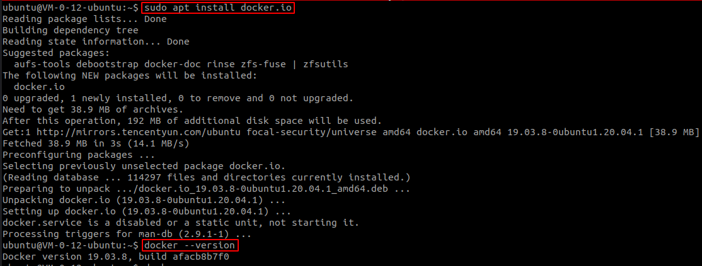
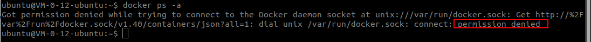
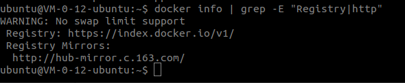

## 安装 Docker

Ubuntu 20.04 官方 apt 源中就有 Docker，我们可以直接通过 apt 来安装

```bash
sudo apt update
sudo apt install docker.io
docker --version
```



## 配置 Docker

### 不使用 Sudo

默认情况下，普通用户没有权限执行 docker 相关操作



需要将普通用户加入到 docker 用户组，并退出 shell 重新登录，即可不使用 sudo 来运行 docker 相关操作

```shell
sudo usermod -aG docker $USER
docker info
```

### 国内源

由于 docker 默认镜像仓库在海外，所以需要配置国内源来加快镜像拉取速度

修改 ``/etc/docker/daemon.json`` (如果该文件不存在，则创建)

```json
{
	"registry-mirrors": [
		"http://hub-mirror.c.163.com"
	]
}
```

重启 docker 守护进程

```shell
sudo systemctl restart docker
```

查看是否生效

```shell
docker info | grep -E "Registry|http"
```



运行 Hello World

```shell
docker run hello-world
docker ps -a
```

## 后记

按照官方的教程 [Install Docker Engine on Ubuntu](https://docs.docker.com/engine/install/ubuntu/) ，需要手动添加 Docker 源，并且包的名称为 docker-ce

但是笔者感觉不如 ``sudo apt install docker.io`` 简单快捷，如有小伙伴知道这两方式的差别，欢迎评论区留言交流。