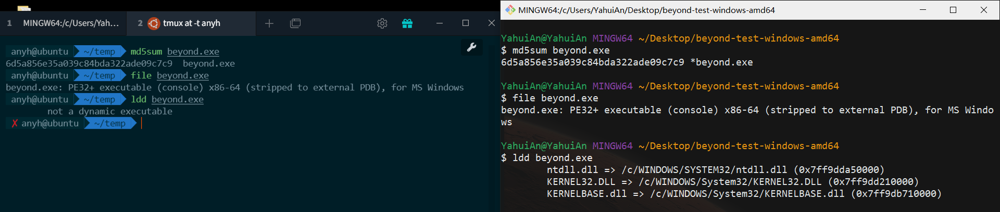

[也谈Go的可移植性](https://tonybai.com/2017/06/27/an-intro-about-go-portability/)

如果代码仅仅是非 ``net`` ``os/user`` 等的普通包，程序默认是静态的，不依赖任何 c lib 等外部动态链接库

如果使用了 ``net`` 等库，``CGO_ENABLED=0`` 纯静态编译，``CGO_ENABLED=1`` 动态链接

如果 ``CGO_ENABLED=1``，但依然要强制静态编译，需传递 ``-linkmode=external`` 给 cmd/link

```shell
$ GOOS=linux GOARCH=amd64 CGO_ENABLED=1 \
go build -a -ldflags '-linkmode "external" -extldflags "-static"' \
-o linux_cgo1_static .
# github.com/yahuian/beyond
/usr/bin/ld: /tmp/go-link-453993773/000004.o: in function `_cgo_6cc2654a8ed3_C2func_getaddrinfo':
/tmp/go-build/cgo-gcc-prolog:58: warning: Using 'getaddrinfo' in statically linked applications requires at runtime the shared libraries from the glibc version used for linking
$ ldd linux_cgo1_static
        not a dynamic executable
```

[cmd/go: -buildmode=c-shared should work on windows](https://github.com/golang/go/issues/11058)

注意：windows 平台可能有些不同，比如开启了 ``CGO_ENABLED=1`` ，结果还是静态编译

```shell
$ GOOS=windows GOARCH=amd64 CGO_ENABLED=1 go build -a -o win_cgo1 .
$ ldd win_cgo1
        not a dynamic executable
```

踩坑：windows 下的 cygwin ``ldd`` 结果和 linux 下的不一致


