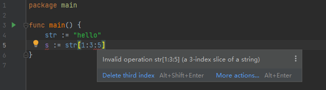

## 切片

切片（slice）是数组的一个引用，它会生成一个指向数组的指针，并通过切片长度关联到底层数组部分或者全部元素。

切片中的元素是可以动态增加，删除的，所以切片通常被用来实现变长数组。

切片的数据结构原型定义如下（```Go/src/runtime/slice.go```）

```go
type slice struct {
	array unsafe.Pointer	// 指向被引用的底层数组的指针
	len   int				// 切片中元素的个数
	cap   int				// 切片分配的存储空间
}
```

## 声明与创建

（1）直接创建切片

```go
var slice1 = []int{1, 2, 3, 4}
fmt.Println(slice1, len(slice1), cap(slice1))
// [1 2 3 4] 4 4
```

（2）基于底层数组创建切片

在创建切片时，可以基于一个底层数组，切片可以只使用数组的一部分元素，或者所有元素，有以下两种表达式：

- Simple slice expressions

```go
// 使用 s = a[start:end] 引用底层数组来初始化切片
// 即切片引用数组元素由 a[start] 到 a[end-1]
// start 和 end 可以省略不写，start 默认值为 0，end 默认值为 len(a)，如 a[:]
var a = [5]int{1, 2, 3, 4, 5}
s1 := a[1:3]
fmt.Println(s1, len(s1), cap(s1)) // [2 3] 2 5

s2 := a[2:]
fmt.Println(s2, len(s2), cap(s2)) // [3 4 5] 3 3


s2[0] = 8 // 注意：由于 s1 和 s2 底层的数组为同一个，所以修改 s2 也会影响 s1
fmt.Println(a)  // [1,2,8,4,5]
fmt.Println(s1) // [2,8]
fmt.Println(s2) // [8,4,5]
```


- Full slice expressions

在前一种方式中，我们无法控制新切片的容量，而使用 ``a[low : high : max]`` 表达式即可达到目的

注意：0 <= low <= high <= max <= cap(a)

```go
a := []int{1, 2, 3, 4, 5}
s1 := a[1:3]
fmt.Println(s1, len(s1), cap(s1)) // [2 3] 2 4

s2 := a[1:3:3] // 限制了切片的容量
fmt.Println(s2, len(s2), cap(s2)) // [2 3] 2 2
```

**注意**：这种方式不能用于字符串



（3）使用make函数创建切片

```go
var sliceName = make(sliceType,len,cap)
// 使用make()函数创建切片时，可以指定切片的元素个数，并且为切片元素预留存储空间
// 在后文切片的操作部分，我们会讲解指定（预估）切片容量的好处
eg:
var slice1 = make([]int, 3, 5)  // 切片的元素个数为3，切片的容量为5
fmt.Println(slice1, len(slice1), cap(slice1))
// [0 0 0] 3 5
```

## 访问和遍历

这个和数组元素的访问以及遍历是一样的

## 内置操作

（1）len()

获取切片中元素的个数

（2）cap()

获取切片的容量大小

（3）append()

使用append()函数向切片**尾部**添加新元素，这些元素保存到底层数组

```go
var s = make([]int, 3, 5)
fmt.Println(s, len(s), cap(s)) // [0 0 0] 3 5

s = append(s, 6)
s = append(s, []int{8, 8, 8}...)
fmt.Println(s, len(s), cap(s)) // [0 0 0 6 8 8 8] 7 10
```

注意：

- 与数组相比，切片多了一个**容量**的概念，即切片中元素的个数和分配的存储空间是两个不同的值

- 如果在append后，没有超过切片的容量大小，哪么容量不会发生变化

- 如果append后，超过了容量大小，则底层会重新分配一块“够大”的内存，具体的**扩容机制**可以在 ```Go\src\runtime\slice.go``` 文件中的 ```growslice``` 函数中看到

- 正如前面我们在使用make()函数创建切片时，如果我们能够预计出合理的容量大小（太大浪费内存空间，太小会不断的扩容），哪么我们在进行切片的append时，可能不会发生扩容，也就避免了切片元素的复制，减少了开销。

（4）copy()

> ```go
> // The copy built-in function copies elements from a source slice into a
> // destination slice. (As a special case, it also will copy bytes from a
> // string to a slice of bytes.) The source and destination may overlap. Copy
> // returns the number of elements copied, which will be the minimum of
> // len(src) and len(dst).
> func copy(dst, src []Type) int
> ```

```go
var slice1 = []int{1, 2, 3, 4, 5, 6}
var slice2 = make([]int, 3, 5)
num := copy(slice2, slice1)
fmt.Println(slice1)  // [1 2 3 4 5 6]
fmt.Println(slice2)  // [1 2 3]
fmt.Println(num)  // 3
```