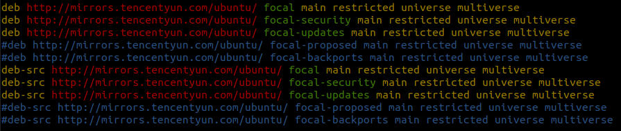

## 前言

之前玩 ubuntu 需要切换国内源地址时，都是网上复制别人提供好的，也不知道是什么意思，拿来就用。

这次花点时间来看看一下 apt sources.list 的格式，以及其表示的含义。

## 格式

sources.list 文件中每一行的格式都如下所示：


以 ubuntu 20.04 为例（腾讯云默认的配置）



### 第一部分

``deb`` 表示二进制可执行文件

``deb-src`` 表示包的源代码

### 第二部分

``URL`` 仓库地址

阿里 http://mirrors.aliyun.com/ubuntu/

腾讯 http://mirrors.tencentyun.com/ubuntu/

网易 http://mirrors.163.com/ubuntu/

其他 [国内开源镜像站点汇总](https://segmentfault.com/a/1190000000375848)

### 第三部分

发行版代号，ubuntu 20.04 为 focal

```shell
ubuntu@VM-0-12-ubuntu:~$ lsb_release -a
No LSB modules are available.
Distributor ID: Ubuntu
Description:    Ubuntu 20.04.1 LTS
Release:        20.04
Codename:       focal
```

- ``security``  重要的安全更新

- ``updates``  建议的更新

- ``proposed``  pre-released 更新

- ``backports`` 不支持的更新（遇到问题不一定有人修，而且可能导致系统出其他问题）

一般情况下，一般选择前 2 个即可。

### 第四部分

是按照软件的自由度来区分的

- ``main``  包是免费的/开源的，并受 ubuntu 官方的支持

- ``restricted``  包含各种设备的专用驱动程序

- ``universe``  包是免费的/开源的，由社区支持

- ``multiverse``  由于法律/版权问题，这些软件包受到限制

一般情况下，4 个全部选择即可

## 使用 sed 快速替换

```shell
sed -i 's/被替换的内容/要替换成的内容/' file
sudo sed -i 's/archive.ubuntu/mirrors.aliyun/' /etc/apt/sources.list
```

## Reference

[/etc/apt/sources.list – SourcesList file in Ubuntu distribution](https://techpiezo.com/linux/etc-apt-sources-list-sourceslist-file-in-ubuntu-distribution/)

[源中的 backports proposed security updates 的意思](https://forum.ubuntu.org.cn/viewtopic.php?f=77&t=253103&sid=079acd573def388dcb46c8ba1c4bc694)

